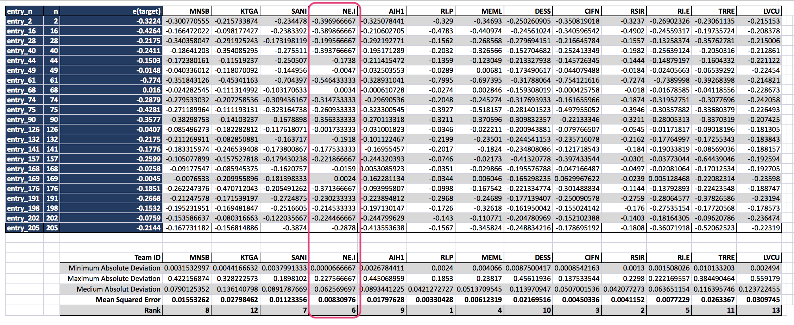

# iKnow2k17
iKnow 2017 Data science challenge

# Introduction
This is my solution to the [iKnow 2017](https://i-know.tugraz.at/data-science-challenge/)
data science challenge. In which i sadly only achieved the 6th best solution. ... Well maybe next year.
The challenge is described in the official [guide](task_description.pdf)

# Solutions
I provide two solutions, both based on using a lookup table that generated out of the training set.

* The first (simple) [solution](/src/final_submission.ipynb) is performing a single lookup based on the lattice structure.
A simple approximation algorithm is used to calculate the euclidean distance for each atom pair in the
lattice. The accumulated distance is used as a proxy metric to evaluate the similarity between two structures.
The predicted energy of the new structure is than the average of the three most similar lookup structures.

* The second (more complex) [solution](/src/simple_final_submission.ipynb) is using the results of the first lookup and tries to refine it
by performing a second lookup based on a subset of the original lookup table (defining the subset as a
fraction of lookup table that was closest evaluated by the first lookup operation) taking into
account the variance in the average mesh size/distance. This is another approximation of similarity between
two structures, and like during the first lookup, the three most similar results are used to approximate
the energy of the new structure.

Using [cross validation](src/cross_validation.ipynb) I could verify that the second solution produced 
on average a slightly lower mean error rate on variance.

As the difference between the solution is minor, I would now, choose the first (simple) one
because of its simplicity and computational efficiency.

# Results
The final submission made it to the 6th position (with a amazing minimum absolute deviation!)

